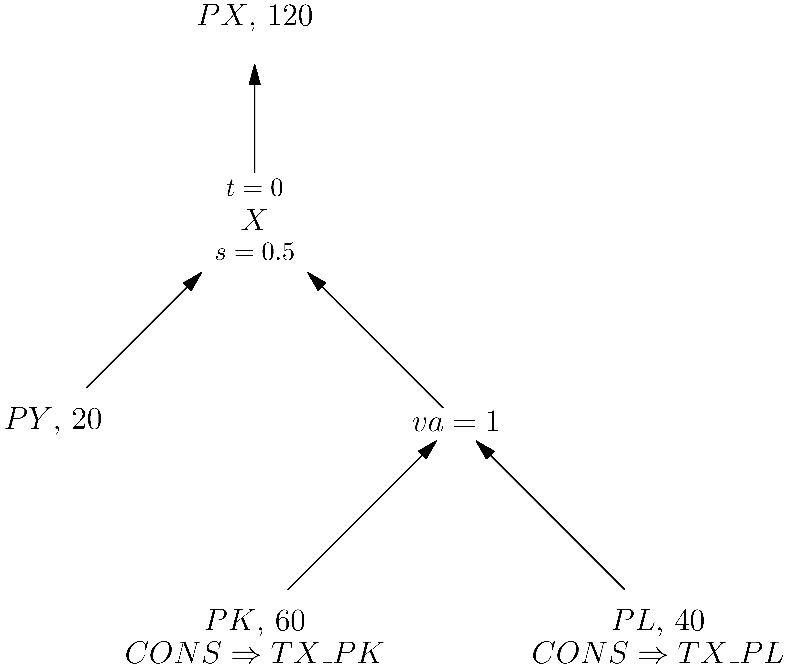

# Basic Structure of a Scalar MPSGE.jl model 

There are four components to constructing a model in MPSGE: 

1. Declare parameters and variables. Variables are: sectors, commodities, consumers, and auxiliary variables. 
2. For each sector create a production block which defines the flow of commodities into and out of the sector. 
3. For each consumer create a demand block which defines the consumers final demands and market endowments. 
4. Define constraints on the auxiliary variables. 

In the remainder of this section, we will construct and compare an example three ways: in MPSGE/GAMS, MPSGE.jl, and the explicit algebraic MCP formulation using JuMP.jl.


## Model Description

We will consider a basic two-good, two-factor closed economy with fixed factor endowments and one representative consumer. The model will include intermediate inputs and nesting. The initial data for this model is represented in a Social Accounting Matrix (SAM):

|Markets  | X   | Y    |  W   | CONS |
| ------- |---  |---   |----  |------|
| PX      | 120 | -20  | -100 |      |
| PY      | -20 | 120  | -100 |      |
| PW      |     |      |  200 | -200 |
| PL      | -40 | -60  |      | 100  |
| PK      | -60 | -40  |      | 100  |

In this model there are three production sectors, `X`, `Y`, and `W`, and a single consumer `CONS`. The rows correspond to markets for five commodities: two goods `PX` and `PY`, a welfare good `PW`, and two primary factors labor, `PL`, and capital, `PK`. Positive values represent supply to the market, a sale, or an output. Negative values represent demand from the market, a purchase, or an input.

The total value of good `PX` purchased by sector `X` is $120\cdot PX\cdot X$, where `X` is the activity level of sector `X`. We take the unit on `120` to be such that the initial activity level of sector `X` and price of `PX` are both 1 and say 120 is the _representative quantity_ of good `PX` for sector `X`. This assumption greatly simplifies model verification as we are starting with a balanced dataset, meaning the row and columns sums are zero. Unital initial values means, at the initial values, all constraints simplify to either row or column sums of the SAM, which are zero. Neither unital initial values nor balanced data are necessary conditions for a CGE model, but they are common assumptions in the literature and make model verification easier.

This example is a scalar model, meaning no sets or indices are used. This simplifies the model and allows us to focus on the structure and the syntax of MPSGE. However, MPSGE can also be used to create indexed models, which are more common in practice, this will be covered in a future example.

This is a slightly modified version of model `M22` from [Jim Markusen's MPSGE tutorial](https://mpsge.org/tutorial.pdf). The code for these examples can be found in the `src` directory. Be sure to activate the Julia environment.

## Preamble

The preamble is the necessary setup that comes before the model definition. In this example we need to import the packages and define necessary data, two tax parameters.


Julia and GAMS are fundamentally different programming languages. GAMS is a script based language with no support for functions and case insensitive syntax. Julia, on the other hand, relies on functions for speed and modularity and has case sensitive syntax. Thus, the structure of the code for each version is quite different. In GAMS, the entire model is defined in a single script. In Julia, we define the model within a function, which allows us to create multiple versions of the model within the same script.

For the two Julia versions we are going to create functions to wrap the model definition. This will do two things: it will avoid naming conflicts between the two models and will make our code run faster. Julia compiles functions before their first run which will speed up subsequent runs. 

In the two Julia examples, we create two variables `TX_PL_0` and `TX_PK_0` to hold the initial tax rates. We will use these values to create model parameters in the next section.

```julia
# MPSGE.jl 
using MPSGE

function mpsge_version()

    TX_PL_0 = 0
    TX_PK_0 = 0

    M = MPSGEModel()

    # Put the rest of the MPSGE code here, inside the function

end
```

```julia
# Julia - MCP
import JuMP
import PATHSolver

function mcp_version()

    TX_PL_0 = 0
    TX_PK_0 = 0

    MCP = Model(PATHSolver.Optimizer)

    # Put the rest of the MCP code here, inside the function

end
```

There are two methods for importing packages into Julia: `using` and `import`. The `using` statement brings all exported names from a module into the current namespace. While this is convenient, it can lead to name clashes if multiple modules export the same names. On the other hand, `import` allows you import a package by its name only, requiring you to prefix functions and types with the module name. 


```gams
* GAMS
PARAMETERS
    TX_PL,
    TX_PK;

TX_PL = 0;
TX_PK = 0;

$ONTEXT
$MODEL: M22

* The rest of the GAMS code goes here, inside the $ONTEXT/$OFFTEXT block

$OFFTEXT
$SYSINCLUDE mpsgeset M22
```


## Model Parameters

Julia and GAMS treat parameters differently. In GAMS, all data is defined as a `parameter` and can be modified between solves to run different scenarios. In Julia parameters are explicitly declared in the model and other input data is static, we need to explicitly define model parameters. However, the syntax to do so differs between MPSGE.jl and JuMP.jl. In MPSGE.jl, we use the `@parameters` macro to define model parameters and in JuMP.jl, we define parameters as `JuMP.Parameter` variables within the model using the `@variables` macro. 

```julia
# MPSGE.jl
@parameters(M, begin
    TX_PL, TX_PL_0, (description = "Ad valorem tax on sector X good PL")
    TX_PK, TX_PK_0, (description = "Ad valorem tax on sector X good PK")
end)
```

```julia
# Julia - MCP
JuMP.@variables(MCP, begin
    TX_PL in JuMP.Parameter(TX_PL_0)
    TX_PK in JuMP.Parameter(TX_PK_0)
end)
```

The two macros, `@parameters` and `@variables`, have a similar syntax. Both macros require the model instance as the first argument. The second argument is a `begin ... end` block that contains the parameter definitions, each on a separate line with no commas to end a line. 

In MPSGE.jl, each parameter is required to have a name and initial value. In the first line, we declare the parameter `TX_PL` with an initial value of `TX_PL_0`. We also provide an optional description for each parameter. Note that optional keyword arguments must be wrapped in parentheses. This is a Julia syntax requirement, the `=` has heightened precedence. 

In JuMP, each parameter is required to have a name and is then declared to be a `JuMP.Parameter` with an initial value. JuMP does not support descriptions for parameters.

## Variables

MPSGE has four types of variables: sectors, commodities, consumers, and auxiliary variables. Of these variable types, sectors, commodities, and consumers are positive variables with specific economic interpretations. We will now discuss each variable type in turn:


- A `sector`, or activity, is a production activity that converts commodity inputs into commodity outputs. The variable associated with a sector is the **activity level** of that sector. We assume sectors start at 100% of their initial activity level, so the starting value for each sector variable is `1`.

- A `commodity`, or market, is a good or service that is bought and sold in the economy. The variable associated with a commodity represents the **price** of the commodity. We again assume the initial price is `1` for each commodity.

- A `consumer` is a representative agent that supplies market endowments,  receives tax revenue, and pays subsidies. The variable associated with a consumer is the total **income** of the consumer with starting value equal to the initial income level. 

- `Auxiliary` variables are user-defined variables that can be used to represent additional economic concepts not captured by sectors, commodities, or consumers. They can represent endogenous quantities which are functions of other variables such as prices and quantities. Auxiliary variables have a default start value of `0` and are unbounded unless otherwise specified. 
 


MPSGE.jl syntax has been designed to mirror the MPSGE/GAMS syntax as closely as possible. 


```julia
# MPSGE.jl
@sectors(M, begin
    X, (description = "Activity level for sector X")
    Y, (description = "Activity level for sector Y")
    W, (description = "Activity level for sector W (Hicksian welfare index)")
end)

@commodities(M, begin
    PX, (description = "Price index for commodity X")
    PY, (description = "Price index for commodity Y")
    PL, (description = "Price index for primary factor L")
    PK, (description = "Price index for primary factor K")
    PW, (description = "Price index for welfare (expenditure function)")
end)

@consumer(M, CONS, description = "Income level for consumer CONS")
```

```gams
* GAMS
$SECTORS:
    X ! Activity level for sector X
    Y ! Activity level for sector Y
    W ! Activity level for sector W (Hicksian welfare index)

$COMMODITIES:
    PX ! Price index for commodity X
    PY ! Price index for commodity Y
    PL ! Price index for primary factor L
    PK ! Price index for primary factor K
    PW ! Price index for welfare (expenditure function)

$CONSUMERS:
    CONS ! Income level for consumer CONS
```


The syntax for the plural macros `@sectors`, `@commodities`, `@consumers`, and `@auxiliaries` is similar to the `@parameters` macro, without the need for the initial value. Each of the plural macros has a singular counterpart: `@sector`, `@commodity`, `@consumer`, and `@auxiliary`. We use the singular macro `@consumer` to define the single consumer `CONS`. 

MPSGE automatically sets the correct starting values and bounds for each variable. Sectors and commodities are non-negative with a starting value of 1. Consumers are also non-negative but have a starting value of their initial income level, which is defined in the demand block in a later section.

The JuMP syntax for defining variables is slightly different. Similar to the defined parameters, we use the `@variables` macro to define all variables in a single block. We need to manually specify the non-negativity constraints and starting values for each variable. 

```julia
# Julia - MCP
JuMP.@variables(MCP, begin
    X>=0,    (start = 1)
    Y>=0,    (start = 1)
    W>=0,    (start = 1)
    PX>=0,   (start = 1)
    PY>=0,   (start = 1)
    PL>=0,   (start = 1)
    PK>=0,   (start = 1)
    PW>=0,   (start = 1)
    CONS>=0, (start = 200)
end)
```

Notice that we must know the initial consumer income level to set the starting value for `CONS`. In this small example, it is easy to see from the SAM that the initial income level is 200. However, in larger models, it may be more difficult to determine the initial income level especially with non-zero initial tax values.

The two parameters defined in the `@variables` macro in the previous section could be included in this `@variables` block as well. They were separated to highlight the syntactic differences between MPSGE and JuMP. 

## Production

In MPSGE, we think of each sector as a representative firm. Firms produce output commodities by combining input commodities. The specific inputs and outputs for each sector are defined in a production block. MPSGE takes the information in a production block and generates a _cost function_ (not a production function). The complementary variable is the sectoral activity level. 

The functional forms of the cost functions in MPSGE are Constant Elasticity of Substitution (CES) or Cobb-Douglas. MPSGE will choose the correct functional form based on the elasticity of substitution specified in the production block.


### The X Sector
The inputs/outputs to the `X` sector are specified in the `X` column of social accounting matrix. We have extracted (and transposed) the `X` column below.

|   | PX  | PY  | PW  | PL  | PK  |
|---|---- |---- |---- |---- |---- |
|X  | 120 | -20 |     | -40 | -60 |


Outputs are represented by positive values, sector `X` produces 120 units of commodity `PX`. Conversely, inputs are negative values, sector `X` uses 20 units of commodity `PY`, 40 units of commodity `PL`, and 60 units of commodity `PK`. However, the social accounting matrix does not contain information about composite goods, taxes, or elasticities. In this example, the goods `PL` (labor) and `PK` (capital) are combined into a composite good. It is more accurate to represent the input/output structure of sector `X` as a directed tree:



The leaves of the tree represent the purchase/sale of commodities and contain the same information as the social accounting matrix, e.g. `X` is outputting 120 units of `PX` and so on. Each leaf can also be assigned taxes, in this example both `PK` and `PL` have a tax value which is paid to the consumer `CONS`. While not present in this example, the leaves can also be assigned reference prices. A reference price is used to adjust the starting price of a commodity, for example to offset the value of a tax. By default, the reference price is set to `1`. 


Internal nodes in the tree represent composite goods, or nests. In this example, labor, `PL`, and capital, `PK`, are combined into the composite good `va` with elasticity 1. The composite good `va` is then combined with the good `PY` with an elasticity of substitution of `0.5`. The sector outputs a single good `PX`. 


A traditional treatment of this social accounting matrix would require the modeller to manually decompose the composite goods, creating a new sector as an intermediate step. MPSGE does this automatically, which reduces the time to create a model, potential errors, and model complexity. 

We will now show how to represent this production structure in both GAMS and MPSGE.jl. We will then discuss each component of the production block.


```julia
# MPSGE.jl
@production(M, X, [t=0, s=0.5, va => s = 1], begin
    @output(PX, 120, t)
    @input(PY,   20, s)
    @input(PL,   40, va, taxes = [Tax(CONS, TX_PL)])
    @input(PK,   60, va, taxes = [Tax(CONS, TX_PK)])
end)
```

```gams
* GAMS
$PROD:X s:0.5 va:1
    O:PX Q:120
    I:PY Q: 20
    I:PL Q: 40 va: A:CONS T:TX_PL
    I:PK Q: 60 va: A:CONS T:TX_PK
```


Each production block is structured similarly:

1. Identify the sector, in this case `X`.
2. Define the nesting structure and elasticities.
3. Define the inputs and outputs.

Let's begin our discussion with the nesting structure and elasticities. In GAMS, the nesting structure is `s:0.5 va:1`. This states that the elasticity of substitution for the top-level nest is `s` is `0.5`, the elasticity of substitution for the composite good `va` is `1`, and the elasticity of transformation `t` is `0`, which is not explicitly stated. In this version it is not obvious that `va` is nested under `s`, this only become apparent when we look at the inputs and outputs. The nest names `s` and `t` are reserved for the top-level nests. 

Nests in MPSGE.jl are much more explicit. There must be exactly two top level nests/elasticities, in the case `t=0` and `s=0.5`, these are specified with a single `=`. Composite nests are specified using the syntax `nest => parent = elasticity`, which can be seen with `va => s = 1`. This explicitly states that the nest `va` is a child of the parent nest `s` with an elasticity of `1`. Note that the elasticity values can be parameters. A future example will detail much more complicated nesting structures, including indexed nests and nests with parametric elasticities. Unlike MPSGE/GAMS, the nest names in MPSGE.jl can be any valid Julia identifier, for example instead of `s` we could use `substitution`. 

The input/output definitions have a similar format. They both require a commodity and quantity. In GAMS, the nest names are not required for a top-level nest, the output `O:PX Q:120` is automatically assigned to the top-level nest `t`. This is not true in MPSGE.jl, where we must explicitly assign the output to the top-level nest `t` with `@output(PX, 120, t)`.

Taxes are set on inputs/outputs by designating a consumer to receive the tax revenue and providing a tax rate. In GAMS, this is done with `A:CONS T:TX_PL`, which designates the tax agent `CONS` to receive the tax revenue from the input of `PL` at a rate of `TX_PL`. In MPSGE.jl, we use the keyword argument `taxes` to provide a list of taxes associated with the input or output. Each tax is created using the `Tax(consumer, rate)` constructor. In this case, we create a single tax on the input of `PL` with `taxes = [Tax(CONS, TX_PL)]`. MPSGE automatically distributes the tax revenue.

The `t:` field in MPSGE/GAMS indicates the tax is exogenous, or a parameter value. If the tax was endogenous, or an auxiliary variable, you must use the `n:` field to indicate the name of the auxiliary variable. This is an artifact of how MPSGE/GAMS treats parameters and variables, the `t:` field expects a parameter and will error if it is a variable. This is not an issue in MPSGE.jl, the `Taxes` function can accept any valid expression for the tax rate, included parameters, variables, or a general expressions.


We now turn our attention to constructing the algebraic version of the cost functions for this production block. Even for this simple example, this can be a tedious and error-prone process. We are going to break this into steps to understand each component. In actuality, we create unit cost functions. The cost function is the unit cost function multiplied by the quantity of output. 

We are going to create the unit cost functions for each node of the tree, starting with the leaves and working our way up to the root. The unit cost functions for the leaves are simply the tax-adjusted prices of each commodity. In general, the tax-adjusted price for a commodity $P$ with taxes $t_i$ and reference price $rp$ is given by:

```math
\frac{P\cdot (1 \pm \sum_i t_i)}{rp}
```

Where the sign is positive for inputs and negative for outputs.

The unit cost functions for `PL` and `PK` are given by:
```math
\begin{align*}
cost\_X\_va\_PL &= PL \cdot (1 + TX\_PL) \\
cost\_X\_va\_PK &= PK \cdot (1 + TX\_PK)
\end{align*}
```

Using these we can construct the unit cost function for the composite good `va`, which combines `PL` and `PK` with an elasticity of substitution of `1`, or a Cobb-Douglas functional form. The unit cost function for the composite good `va` is given by:

```math
cost\_X\_va = cost\_X\_va\_PL^{(40/100)} \cdot cost\_X\_va\_PK^{(60/100)}
```

The unit cost function for the top-level nest `s` combines the composite good `va` and the input good `PY` with an elasticity of substitution of `0.5`. Thus, we use a CES functional form to create the unit cost function:

```math
cost\_X = \left(\frac{20}{120} \cdot cost\_X\_PY^{(1-0.5)} + \frac{100}{120} \cdot cost\_X\_va^{(1-0.5)}\right)^{\frac{1}{1-0.5}}
```

where $`cost\_X\_PY = PY`$ as there are no taxes on good `PY`.

Finally, there is only a single output commodity `PX`. Thus, the unit cost function on the output side, which we will call revenue, is simply given by:

```math
revenue\_X = PX
```

The total profit for the sector `X` is the difference between total revenue and total cost. To get total cost, we multiply the unit cost by the quantity, in this case `120`. Note that the quantity is the reference quantity multiplied by the reference price. A future example will fully detail reference prices. The profit function for sector `X` is given by:

```math
profit\_X = 120 \cdot revenue\_X - 120 \cdot cost\_X
```

And the zero profit constraint is:

```math
-profit\_X = 0 \perp  X
```

This is all translated into Julia JuMP syntax as follows:

```julia
# Julia - MCP

cost_X_va_PL = PL * (1 + TX_PL)
cost_X_va_PK = PK * (1 + TX_PK)
cost_X_va = cost_X_va_PL^(40/100) * cost_X_va_PK^(60/100)

cost_X_PY = PY

cost_X = (20/120*cost_X_PY^(1-.5) + 100/120*cost_X_va^(1-.5))^(1/(1-.5))

revenue_X = PX

profit_X = 120*revenue_X - 120*cost_X

JuMP.@constraint(MCP, zero_profit_X, -profit_X ⟂ X)
```
The flexibility of the JuMP syntax allows us to closely match the mathematical notation. One difference, in the `@constraint` macro we do not need $=0$ on the profit function as this is implied by the complementarity operator $\perp$. The $\perp$ operator can be input into Julia using typing the LaTeX `\perp` followed by the `TAB` key. 

After we fully specify our models, we will extract the same cost functions from the MPSGE.jl version. At its core, MPSGE.jl is simply a tool to generate the cost functions which are then used to specify the model. 

### The Other Sectors
The production blocks for the remaining sectors, `Y` and `W`, are defined similarly. We won't detail these as they are similar to sector `X`.

```gams
* GAMS
$PROD:Y s:0.75 va:1
    O:PY Q:120
    I:PX Q: 20
    I:PL Q: 60 va:
    I:PK Q: 40 va:

$PROD:W s:1
    O:PW Q:200
    I:PX Q:100
    I:PY Q:100
```

```julia
# MPSGE.jl
@production(M, Y, [t=0, s=0.75, va=>s=1], begin
    @output(PY, 120, t)
    @input(PX, 20, s)
    @input(PL, 60, va)
    @input(PK, 40, va)
end)

@production(M, W, [t=0, s=1], begin
    @output(PW, 200, t)
    @input(PX, 100, s)
    @input(PY, 100, s)
end)
```

```julia
# Julia - MCP

## Y Block

### VA Nest
cost_Y_va_PL = PL
cost_Y_va_PK = PK
cost_Y_va = cost_Y_va_PL^(60/100) * cost_Y_va_PK^(40/100)

cost_Y_PX = PX

cost_Y = (20/120*cost_Y_PX^(1-.75) + 100/120*cost_Y_va^(1-.75))^(1/(1-.75))

revenue_Y = PY
profit_Y = 120*revenue_Y - 120*cost_Y

JuMP.@constraint(MCP, zero_profit_Y, -profit_Y ⟂ Y)

## W Block

cost_W_PX = PX
cost_W_PY = PY

cost_W = cost_W_PX^(100/200) * cost_W_PY^(100/200)

revenue_W = PW
profit_W  = 200*revenue_W - 200*cost_W


JuMP.@constraint(MCP, zero_profit_W, -profit_W ⟂ W)
```

## Demands
The final component of this MPSGE model is the demand block. The demand block defines the final demands and endowments for each consumer. In this example, there is a single consumer `CONS`. The final demands and endowments are specified in the `CONS` column of social accounting matrix. We have extracted (and transposed) the `CONS` column below. The final demands are given by negative values, while endowments are given by positive values.


|      | PX | PY | PW   | PL  | PK  |
|---   |----|----|----  |---- |---- |
| CONS |    |    | -200 | 100 | 100 |


The demand blocks for both versions of MPSGE are shown below. The translation between the version should be self-evident. 

```gams
* GAMS
$DEMAND:CONS
    D:PW Q:200
    E:PL Q:100
    E:PK Q:100

```

```julia
# MPSGE.jl
@demand(M, CONS, begin
    @final_demand(PW, 200)
    @endowment(PL, 100)
    @endowment(PK, 100)
end)
```

MPSGE uses the demands to create the consumer income, which is the sum of the endowments plus any tax revenue received. 

The quantity field in MPSGE/GAMS is restricted not allowed to be a variable. If the endowment is to be modified by an auxiliary variable the `r:` field must be used. The `r:` field stands for `rate` and it multiplies the value of the endowment. For example, if the endowment of `PL` was to be modified by an auxiliary variable `END_PL`, we would use the syntax `E:PL Q:100 r:END_PL`. This would create an endowment of `100*END_PL`. This is not an issue in MPSGE.jl, the `@endowment` macro can accept any valid expression for the endowment value, including variables and general expressions. In other words, we could write `@endowment(PL, 100*END_PL)` without needing to use a special field for the rate.

The algebraic JuMP version is more complicated as it requires us to compute the total tax revenue received by the consumer. Tax revenue is the tax rate multiplied by the total value of the good being taxed. The total value is the sectoral activity level multiplied by the price and the compensated demand for the good. Compensated demand is given by the partial derivative of the profit function with respect to the tax-adjusted price of the good, this is a consequence of Hotelling's lemma.

The tax revenue from the tax good `PL` in sector `X` can be expressed mathematically as:

```math
\begin{align*}
tax\_X\_PL = & 40\cdot TX\_PL\cdot X\cdot PL\cdot \frac{\partial(profit\_X)}{\partial (cost\_X\_va\_PL)} \\
=&40\cdot TX\_PL\cdot X\cdot PL\cdot \left(\frac{cost\_X}{cost\_X\_va}\right)^{.5}\cdot \left(\frac{cost\_X\_va}{cost\_X\_va\_PL}\right)
\end{align*}
```

We leave the computation of the partial derivative as an exercise for the reader.

We similarly define `tax_X_PK` for the tax from sector `X` on good `PK`. The total income for consumer `CONS` is given by:

```math
income = 100\cdot PL + 100\cdot PK + tax\_X\_PL + tax\_X\_PK
```

Finally, the income balance constraint is given by:

```math
CONS - income = 0 \perp CONS
```

Which in JuMP syntax is:

```julia
# Julia - MCP
tax_X_PL = 40*TX_PL*X*PL*(cost_X/cost_X_va)^.5*(cost_X_va/cost_X_va_PL)
tax_X_PK = 60*TX_PK*X*PK*(cost_X/cost_X_va)^.5*(cost_X_va/cost_X_va_PK)

income = 100*PL + 100*PK + tax_X_PL + tax_X_PK
JuMP.@constraint(MCP, income_balance, CONS - income ⟂ CONS)
```


## Market Clearance Conditions
From an MPSGE perspective, the model is fully specified at this point. MPSGE automatically creates the market clearance conditions for all commodities. However, we must manually create the market clearance conditions for each commodity in the algebraic version.

The market clearance condition for a given commodity `P` over sectors $S_i$ is given by:

```math
\sum_{i} S_i\cdot \left( \frac{\partial( profit\_S_{i})}{\partial \bar{P}} \right)  + \sum endowments - \sum final\_demands  = 0 \perp P
```

where $\bar{P}$ is the tax adjusted price of `P` and the partial derivative is given by Hotelling's lemma, as before. The market clearance conditions for each commodity are shown below in JuMP syntax:

```julia
# Julia - MCP

## PX

market_PX = 120*X - 20*Y*(cost_Y/cost_Y_PX)^.75 - 100*W*(cost_W/cost_W_PX)^1
JuMP.@constraint(MCP, clearance_PX, market_PX ⟂ PX)

## PY

market_PY = 120*Y - 20*X*(cost_X/cost_X_PY)^.5 - 100*W*(cost_W/cost_W_PY)^1
JuMP.@constraint(MCP, clearance_PY, market_PY ⟂ PY)

## PL

market_PL = -40*X*(cost_X/cost_X_va)^.5*(cost_X_va/cost_X_va_PL) - 60*Y*(cost_Y/cost_Y_va)^.75*(cost_Y_va/cost_Y_va_PL) + 100
JuMP.@constraint(MCP, clearance_PL, market_PL ⟂ PL)

## PK

market_PK = -60*X*(cost_X/cost_X_va)^.5*(cost_X_va/cost_X_va_PK) - 40*Y*(cost_Y/cost_Y_va)^.75*(cost_Y_va/cost_Y_va_PK) + 100
JuMP.@constraint(MCP, clearance_PK, market_PK ⟂ PK)

## PW

market_PW = 200*W - CONS/PW
JuMP.@constraint(MCP, clearance_PW, market_PW ⟂ PW)
```

It should be noted that this process is mathematically simple, but in larger models it can be tedious and error prone. The purpose of MPSGE is to eliminate this step for the modeller, allowing them to focus on the economic structure of the model.


## Verifying the Benchmark Solution

We are starting with balanced data, the row and column sums of the social accounting matrix are zero. Thus, we expect all constraints to be satisfied at the initial values. We can verify this by solving the model and specifying that no iterations should be taken. We will also set the price of welfare `PW` to be fixed at `1` as the numeraire.

The MPSGE/GAMS version is shown below:

```gams
* GAMS
PW.FX = 1;

M22.iterlim = 0;
$INCLUDE M22.GEN
SOLVE M22 USING MCP;
```
We can verify this is correct by checking the model report after solving. The residual value should be zero, and the marginal value for each constraint should also be zero.

The two Julia versions were defined inside of functions, so we need to call the functions to create the model instances before solving. To extract variables from the model instance we use the syntax `model[:variable_name]`, for example to extract the variable `PW` from the MPSGE.jl version we use `M[:PW]`. We can then fix the price of welfare at `1` and solve the model with zero iterations as follows:

```julia
# MPSGE.jl
M = mpsge_version()

fix(M[:PW], 1)

solve!(M, cumulative_iteration_limit=0)
```
The user should see the residual value in the REPL and can check the marginal values of each constraint using the command `generate_report(M)`.

Finally, the JuMP.jl version:
```julia
# Julia - MCP
MCP = mcp_version()

JuMP.fix(MCP[:PW], 1.0; force = true)

JuMP.set_attribute(MCP, "cumulative_iteration_limit", 0)
JuMP.optimize!(MCP)
```
Again, the REPL will show the residual value after solving. Marginal values can be accessed using `value(MCP[:constraint_name])` for each constraint.

## Counterfactual Scenario

We end this section by running a counterfactual scenario. In this scenario, we will set the value of `TX_PL` to `0.8` and `TX_PK` to `0.5`, re-solve the model, and compare the results between the three versions.

```gams
* GAMS
TX_PL = .8;
TX_PK = .5;

M22.iterlim = 10000;
$INCLUDE M22.GEN
SOLVE M22 USING MCP;
```

```julia
# MPSGE.jl
set_value!(TX_PL, .8)
set_value!(TX_PK, .5)

solve!(M)
```

```julia
# Julia - MCP
JuMP.set_parameter_value(TX_PL, 0.8)
JuMP.set_parameter_value(TX_PK, 0.5)

JuMP.set_attribute(MCP, "cumulative_iteration_limit", 10_000)
JuMP.optimize!(MCP)
```

Note that MPSGE.jl defaults the cumulative iteration limit to `10,000`, so it is not necessary to reset this value.

We have extracted the results for each variable from each version and compiled them into a single table for comparison. Unsurprisingly, all three versions yield identical results up to rounding errors.

| Variable | GAMS      | MPSGE.jl  | JuMP  |
|----------|-------    |---------- |--------- |
| X        | 0.8303    | 0.830262  | 0.830262 |
| Y        | 1.1288    | 1.12882   | 1.12882  |
| W        | 0.9753    | 0.97526   | 0.97526  |
| PX       | 1.1869    | 1.18687   | 1.18687  |
| PY       | 0.8426    | 0.842556  | 0.842556 |
| PL       | 0.7863    | 0.786324  | 0.786324 |
| PK       | 0.7802    | 0.780208  | 0.780208 |
| PW       | 1.000     | 1.000     | 1.000    |
| CONS     | 195.0519  | 195.052   | 195.052  |


## Extracting Cost Functions

In MPSGE.jl, the cost functions can be extracted and viewed using the `cost_function` function. For example, to view the cost function for the sector `X`, we can run:

```julia
cost_function(M[:X])
```
And for the composite good `va` under sector `X`:

```julia
cost_function(M[:X], :va)
```

## Exercises

1. Add a tax to the output of sector `Y`. Verify the benchmark and run a counterfactual scenario where the tax is set to `0.5`. Compare the results of the two Julia versions.
2. New research has found that the elasticity of substitution on the `X` sector is not actually `0.5`. Update the two Julia versions to use each of the following three values and compare the results to the original version:
   - `0.8`
   - `1`
   - `1.5`
3. Building on the previous exercise, update the two versions of the model to make the elasticity of substitution a parameter. Compare the results when the elasticity is set to `0.5`, `0.8`, `1`, and `1.5`.
   